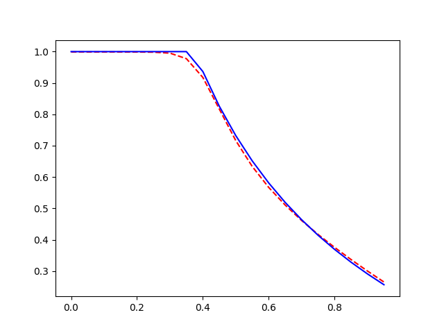

This repository contains parts of the code implemented for my project:
# Improving reservoir forecasting with lesser data

In this work, I studied how knowledge of reservoir physics can help improve data-based models for reservoir prediction. This concept can be generalized to other data-science and Machine Learning areas where we have access to analytical equations that can provide strong prior to the model. My research extends the work of [1]. But this repository only contains the my simple Pytorch based implementation of [1], which uses the PINN developed in [PINN](https://github.com/nanditadoloi/PINN).

### Solution to the Buckley Leverett Fluid Flow model with Convex Flux function at time t=0.75

Dependencies: `pytorch` and `numpy` packages.

[1] Fuks, Olga, and Hamdi A. Tchelepi. "Limitations of physics informed machine learning for nonlinear two-phase transport in porous media." Journal of Machine Learning for Modeling and Computing 1.1 (2020).
